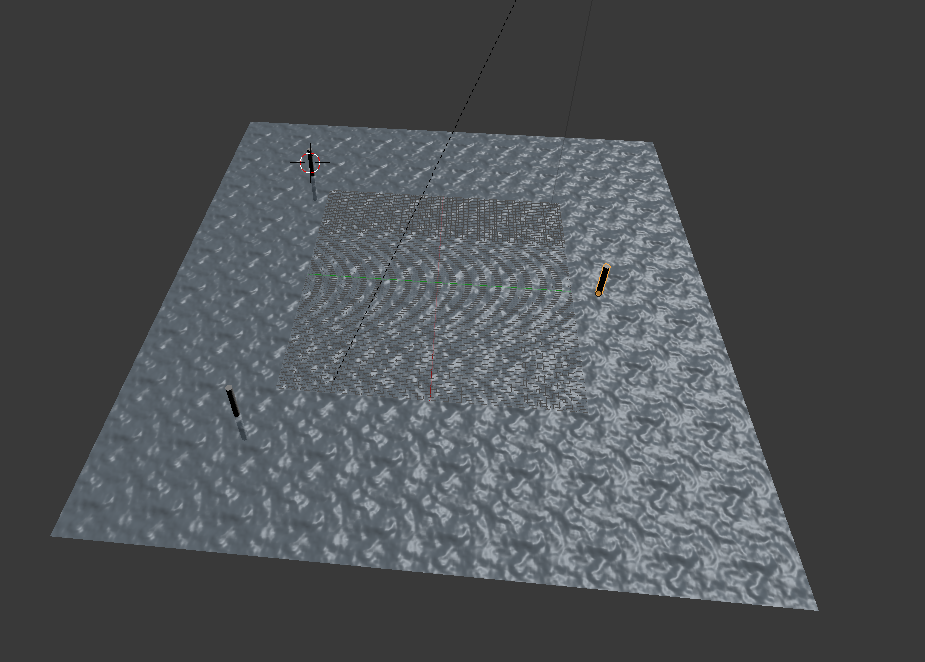
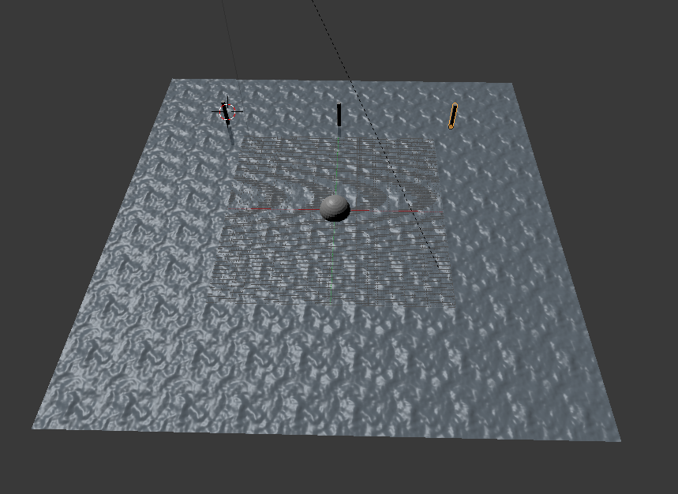
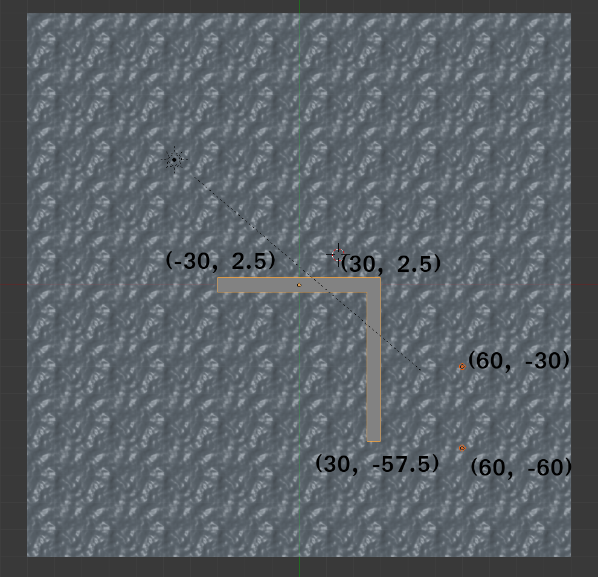
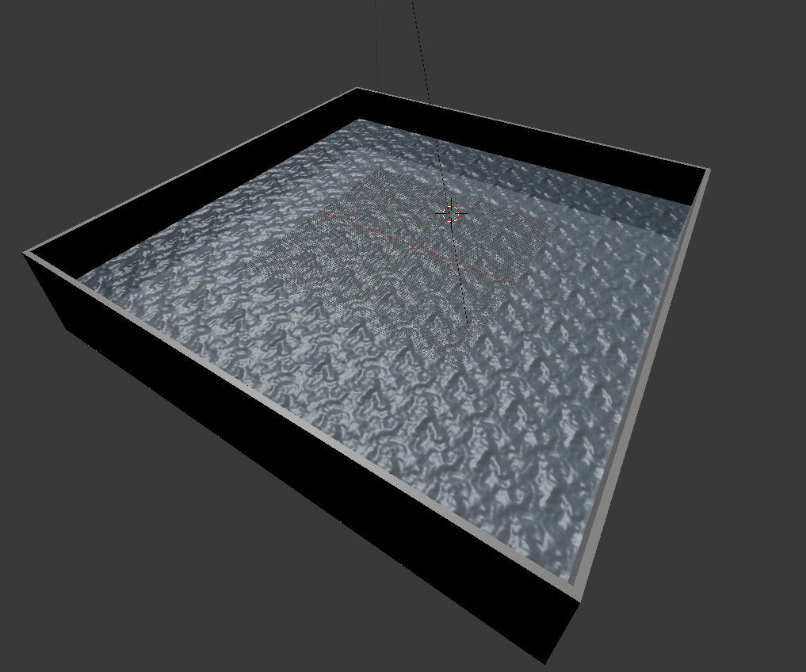
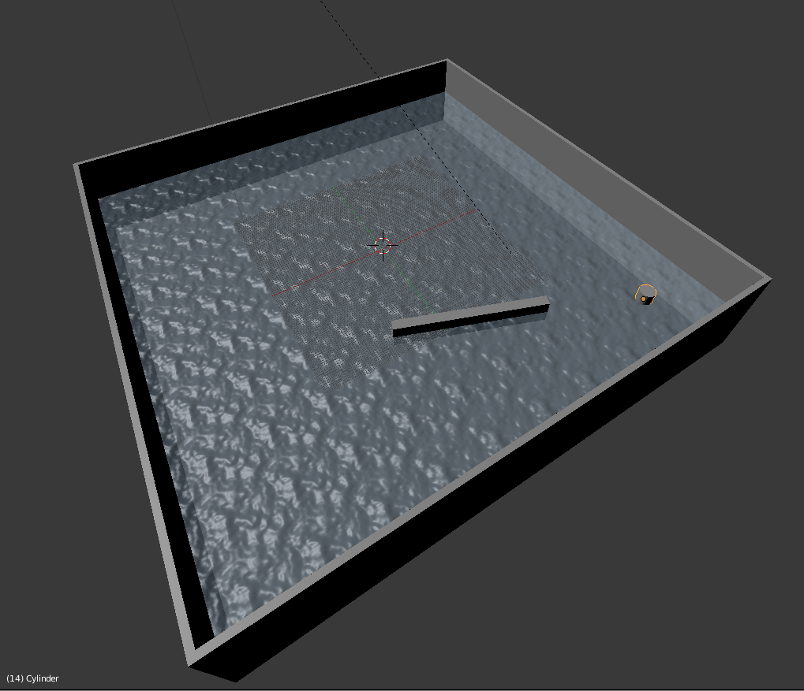
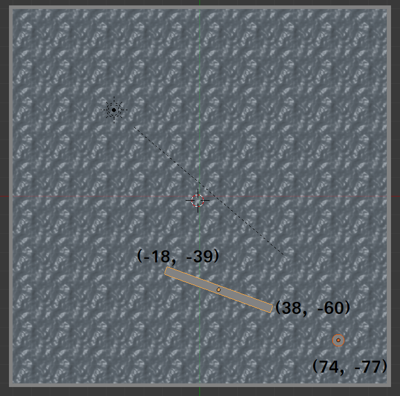

# Informations on the environments

## 3 Waypoints  (*water-3waypoints.blend*)
This is a water environment with 3 waypoints on the following position:
- **Waypoint1**: (-60, -60)
- **Waypoint2**: (  0,  60)
- **Waypoint3**: ( 60, -60)

## 1 Obstacle & 3 waypoints - (*water-1o-3w.blend*)
This is a water environment with 3 waypoints and 1 obstacle:
- **Waypoint1**: (-60, 60)
- **Waypoint2**: (  0, 60)
- **Waypoint3**: ( 60, 60)
- **Obstacle0**: (  0,  0)

## 1 wall & 2 Waypoints - (*water-1w-1wall.blend*)
This is a water environment with a wall and 2 waypoints behind it:
- **Waypoint1**: ( 60, -30)
- **Waypoint2**: ( 60, -60)

## Walls around - (*water-walls.blend*)
This is a water environment surrounded with walls

## Borders & 1 wall & 1 Waypoint - (*water-1w-1o-1b.blend*)
This is a water environment with surrounded by a border with a waypoint and a wall
 | 
